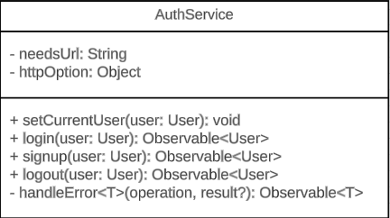
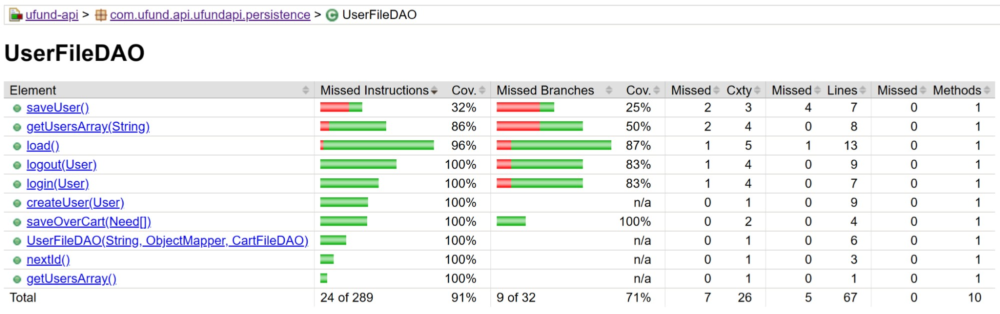

# PROJECT Design Documentation

## Team Information

* Team name: Team 7G
* Team members
  * Michael Brenner
  * Andrew Zou
  * Renzhong Huang
  * Jonathon Ho

## Executive Summary

In this project, we aim to create a web page for an elderly facility. The web page will have an about page where users can learn about our goals and sign in. Once signed in as a user/helper, you will be greeted by a page that shows a list of needs and a list of elderly people that you can adopt. You can add the needs and elderly people you would like to adopt to your cart, check your cart, and submit your cart.

### Purpose

Purpose is to provide a place where people can donate for specific needs for the elderly.
They will also have the ability to adopt an elderly person of whom they can see in their
account.

### Glossary and Acronyms

| Term  | Definition                                       |
| ----- | ------------------------------------------------ |
| SPA   | Single Page                                      |
| adopt | Match a user with an elderly they have "adopted" |
| MVP   | Minimum Viable Product                           |

## Requirements

#### This section describes the features of the application.

On the about us page, I want to display or fill with Lorem Ipsum, a general mission statement of what our U-Fund does, and maybe some images.  This page will appear before the helper or administrator logs in and after they log out of their account.

As the login page, I want to display a prompt for username, a prompt for password, button for submission, and a button to go back to the main page so I can login either as a helper or an admin.

As the main page, I want to display a list of needs, a search bar, a login / logout button, and a “cart” button, so I can display all needs and information for any helpers / admins.

As an Admin I want to manage items in need via removing needs and editing there information so that the Helpers can have accurate information of what is in need.

As the admin page, I want to display the list of needs, an add new need button, button to add and subtract numbers in need for a need, and a button to logout, so I can edit the items in need for the helpers.

As a Helper I want to see the elderlies that needs help and the elderlies that are in need of adoption so that I can provide the requested help and maybe adopt an elderly.

As the login page, I want to display a prompt for username, a prompt for password, button for submission, and a button to go back to the main page so I can login either as a helper or an admin.

As the cart page, I want to display a list of needs in cart, a remove option to remove things from the cart, an order button to complete the list, a back button to go back, so I can see all the needs and information I want to help with as a helper and edit it and complete the list when we don and go back to add more if I needed.

### Definition of MVP

The MVP for this product is a website where users (helpers) can login and add
items (needs) to their carts and checkout. Along with being able to purchase items,
they will be able to adopt elderly people to help support the care and wellbeing
of the elderly they have adopted. The user should be able to see a list of these elderly people
and select who they want to adopt, adding them to the cart to be checked out.
These adopted elderly should be able to be listed as adopted in the elderly list.
When looking at your profile, you should see a list of the elderly people that you have adopted and their associated stasics.

### MVP Features

* About Us Page
* Login Page
* Adopt Elderly Page
  * Heplers can adopt elderly person
  * Admin can change values of elderly
  * Admin can create/delete a new elderly
* Homepage
  * Helpers can buy (Donate) for needs for the care facility
  * Admin can change values of needs
  * Admin can create/delete a new need
* Profile Page
  * Logout button
  * See a list of Elderly that the current user has adopted
* Cart/Basket Page (Helpers only)
  * List of all items in current users cart
  * Remove need from cart
  * Submit cart
* Backend can handle all cart related tasks
  * Add to cart
  * Delete from cart
  * List cart
  * Submit cart
  * Save cart to a file
* Backend can handle all Cupboard related tasks from the frontend
  * Add need
  * Delete need
  * Edit need
  * List needs
  * Save needs to a file
* Backend can handle user authentication and storage
  * Handles login request from frontend
  * Stores current users cart with current user data

### Enhancements

* Adopt Elderly Page:
  On this page you will be able to see a list of elderly people you can adopt.
* About us page
  A page that talks about who we are as a non-profit and what our mission is.
* Signup
  Ability for new helpers to sign up for our website
* List adopted elderlies in user profile (incomplete)
  Every elderly person you adopt will show up in your profile where you can see all of their related stastics

## Application Domain

**General Description Outline:**

1. **Elderly Care Facility (About Us Page):**

   * **Attributes:**
     * Name
     * Location
     * ServicesOffered
     * General information
   * **Functionality:**
     * Provides overall information about the facility.
     * Data is saved to files to ensure changes are reflected for the next user.
2. **Login Page:**

   * **Attributes:**
     * Username
     * Password
   * **Functionality:**
     * Allows users to sign in as different roles, including Helper and U-fund Manager.
     * Provides access to Profile Page, Sign Up Page, and serves as a gateway to other functionalities.
3. **Helper:**

   * **Attributes:**
     * Username
     * Password
   * **Functionality:**
     * View a list of Resident Needs.
     * Search for Resident Needs.
     * Add/Remove Resident Needs to/from their Funding Basket.
     * Proceed to checkout and fund selected Resident Needs.
     * Logout to the Login Page.
     * View and add to the basket of the entity "Need."
4. **U-fund Manager:**

   * **Functionality:**
     * Manage (create/add/delete) Resident Needs stored in the Cupboard.
     * Access to functionalities related to managing the data of Resident Needs.
5. **Profile Page:**

   * **Functionality:**
     * Display a list of elderlies the user wants to adopt.
     * Sign out.
6. **Sign Up Page:**

   * **Functionality:**
     * Create a username.
     * Create a new password.
     * Provide information such as the reason to sign up and email address.
     * Linked to the Login Page.
7. **Adoption Page:**

   * **Functionality:**
     * Contains a list of elderlies that can be adopted.
     * Linked to the Elderly entity.
8. **Elderly:**

   * **Attributes:**
     * id
     * name
     * age
     * gender
     * "level of up keep"
     * "number of children"
     * description
   * **Stored in:**  Adoption JSON file.
   * **Linked to:**  Adoption Page.
9. **Funding Basket JSON File:**

   * **Contains:**  List of the entity "Need."
   * **Linked to:**  Helper entity.
10. **Need:**

    * **Attributes:**
      * NeedID
      * Description
      * Type
      * Status
    * **Stored in:**  Cupboard JSON File.
    * **Linked to:**  Cupboard, Funding Basket, and U-fund Manager entities.
11. **Cupboard JSON File:**

    * **Contains:**  List of the entity "Need."
    * **Linked to:**  U-fund Manager entity.

**Connections:**

* The Login Page is a central hub, connecting users to various functionalities based on their roles (Helper, U-fund Manager).
* The Helper entity interacts with the Need entity, managing the Funding Basket and viewing Resident Needs.
* U-fund Manager manages Resident Needs stored in the Cupboard.
* Adoption Page displays elderlies linked to the Elderly entity and stored in the Adoption JSON file.

**Functionality Summary:**

The website allows Helpers to manage resident needs, fund specific items, and engage in the adoption process.  U-fund Managers are responsible for managing the overall cupboard of resident needs.  The system ensures data consistency by storing information in JSON files, facilitating a seamless experience for users across sessions.

**Overall Purpose:**

The Elderly Care Facility website aims to provide a user-friendly platform for various stakeholders involved in the care facility.  It facilitates the adoption process of elderlies, allows users to contribute to the well-being of residents by funding specific needs, and enables the management of resident needs by U-fund Managers.  The system ensures data consistency across user sessions by saving information to files, enhancing the overall efficiency and effectiveness of the Elderly Care Facility operations.

## Architecture and Design

This section describes the application architecture.

### Summary

The following Tiers/Layers model shows a high-level view of the webapp's architecture.
**NOTE**: detailed diagrams are required in later sections of this document. (_When requested, replace this diagram with your **own** rendition and representations of sample classes of your system_.)

The web application, is built using the Model–View–ViewModel (MVVM) architecture pattern.

The Model stores the application data objects including any functionality to provide persistance.

The View is the client-side SPA built with Angular utilizing HTML, CSS and TypeScript. The ViewModel provides RESTful APIs to the client (View) as well as any logic required to manipulate the data objects from the Model.

Both the ViewModel and Model are built using Java and Spring Framework. Details of the components within these tiers are supplied below.

### Overview of User Interface

This section describes the web interface flow; this is how the user views and interacts with the web application.

When user first go on the website, the user will first see the "About us" page where a summary of the elderly care center is described. On the top right coner will be a "Login" button. After the "Login" button is clicked, it will navigate to the Login page where first tiem user have the option to create an account, and the returning user have the oppertunity to enter their credentials to login. After login, helper will see a list of items that needs help and a button for their cart, including the items they put in cart previously. Then they can add anything to the cart or remove/clear cart. When the user is ready, they can check out the cart. The other page avaliable will be the adoption for elderly, in that page, user can see the details of each alderly that's avaliable for adoption, and they are able to choose what elverly they want to adopt. The adopted elderly will show up in the profile of the user. On the top right corner, will be a button for a drop down menue which include viewing the profile or logout. Once logout button is hit, user will be returned to the main page.

### View Tier

The View Tier of the Elderly Care U-Fund application is a critical component, employing Angular components, stylesheets, and HTML templates to craft an intuitive user interface.  Key components like AppComponent, LoginComponent, and various specialized components facilitate user interactions and seamlessly integrate with the ViewModel Tier.  Accompanying sequence diagrams delineate essential user journeys, including login/logout processes, need additions/removals from the cart, and the adoption of elderly individuals.  These sequences illustrate the coordinated efforts of components and services, such as AuthService, NeedsService, and CartService, in response to user actions.  Additionally, class diagrams provide a static representation of crucial classes within the ViewModel Tier, such as User and AuthService.  Altogether, these detailed summaries offer a comprehensive insight into the View Tier's structure, functionality, and its cohesive interaction with the broader application architecture.

**View Tier Comprehensive Summary:**

The View Tier in the architecture of the Elderly Care U-Fund application is a crucial component responsible for presenting the user interface, handling user input, and interacting with the ViewModel Tier.  Utilizing Angular components, HTML templates, and stylesheets, this tier ensures a visually appealing and functional interface.  Let us explore the key components, sequence diagrams, and class diagrams presented in multiple summaries:

**View Tier Components:**

1. **AppComponent:**

   * Manages the overall layout of the application.
   * Handles the navigation bar with links to different sections.
   * Displays the user's login status, adjusting the UI accordingly.
2. **LoginComponent:**

   * Handles user authentication, including login and signup functionalities.
   * Switches between a login form and a user profile view based on login status.
   * Communicates with the AuthService in the ViewModel Tier.
3. **HomepageComponent, CartpageComponent, AboutusComponent, EditNeedComponent, AdoptpageComponent:**

   * Represent different sections/pages of the application.
   * Display relevant information and provide user interaction specific to each section.
4. **Stylesheets (CSS/SCSS):**

   * Define the visual styling for the components, ensuring a consistent and visually appealing user interface.

**View Tier Sequence Diagrams:**

1. **User Login Sequence:**

   * User triggers the login button in the LoginComponent.
   * LoginComponent sends a login request to AuthService in the ViewModel Tier.
   * AuthService communicates with the server-side API to validate credentials.
   * Upon successful login, AuthService updates user information, and LoginComponent adjusts the UI.

     
2. **User Logout Sequence:**

   * User triggers the logout button in the LoginComponent.
   * LoginComponent sends a logout request to AuthService in the ViewModel Tier.
   * AuthService communicates with the server-side API for logout.
   * Upon successful logout, AuthService clears user information, and LoginComponent updates the UI.

     
3. **User Adds Need to Cart Sequence:**

   * User interacts with the HomepageComponent to add a need to the cart.
   * Components communicate with NeedsService and CartService to update the cart.
   * The server responds with updated information, and the UI is notified.

     
4. **User Removes Item from Cart Sequence:**

   * User interacts with the CartpageComponent to remove an item from the cart.
   * Components communicate with CartService and the server to update the cart.
   * The server responds with updated information, and the UI is notified.

     
5. **Adopting an Elderly Sequence:**

   * User interacts with the "Adopt" button in the Adoptpage Component.
   * The Adoptpage Component sends an HTTP request to the server (AdoptService) to mark the elderly as adopted.
   * The server updates the database and responds with a success message.
   * The Adoptpage Component updates the UI to reflect the adopted status.

     
6. **Updating a Need Sequence:**

   * User interacts with the EditNeed Component to update a need.
   * The EditNeed Component sends an HTTP request to the server (NeedsService) to update the need information.
   * The server updates the database and responds with a success message.
   * The EditNeed Component displays a confirmation message.

     

**View Tier Class Diagrams:**

1. **User Class Diagram:**

   * Represents the structure of the User class, including attributes and relationships.
     
2. **AuthService Class Diagram:**

   * Represents the AuthService class, including methods and interactions with the server-side API.

     
3. **AppComponent Class Diagram:**

   * Represents the structure of the AppComponent class, including relationships and responsibilities.

     
4. **HomepageComponent Class Diagram:**

   * Represents the structure of the HomepageComponent class, including relationships and responsibilities.

     
5. **CartpageComponent Class Diagram:**

   * Represents the structure of the CartpageComponent class, including relationships and responsibilities.

     
6. **AboutusComponent Class Diagram:**

   * Represents the structure of the AboutusComponent class, including relationships and responsibilities.

     

These summaries collectively provide a comprehensive overview of the View Tier in the Elderly Care U-Fund application, covering components, sequences, and class structures.  The detailed breakdown ensures clarity and understanding of the user interface, user interactions, and the connections with the underlying ViewModel and Model Tiers.

### ViewModel Tier

The ViewModel Tier of the Elderly Care U-Fund application is an important component, this revolves around Java controller components. Key components like CupboardController, AdoptionController, and various specialized components facilitate the reaction taken in from the front end over to the backend after receiving user interactions and seamlessly integrate with the View and the Model Tier. Accompanying sequence diagrams delineate essential the backend of user journeys after each action the user performs, including login/logout processes, need additions/removals from the cart, and the adoption of elderly individuals. These sequences illustrate the coordinated efforts of components and services, such as the DAO files interacting with the controller commands to respond to user action requests. Additionally, class diagrams provide a static representation of crucial classes within the ViewModel Tier, such as User, controller, and AdoptionController. Altogether these detailed summaries offer a comprehensive insight into the ViewModel Tier’s structure, functionality, and cohesive interaction with the broader application architecture.

The ViewModel tier is a very crucial part of the overall architecture, acting as a bridge between the View and Model tiers. It is responsible for handling both logic and providing data to the UI to allow the UI to update the view accordingly and be suitable for presentation. This tier utilizes both the view tier and model tier components to ensure that both of them work together and allow for a seamless and functional UI.

**CupboardController Class Diagram:**

* The ViewModel tier utilizes components such as CupboardController to bridge the actions from a user into specific methods
* Represents the CupboardController class, including methods and interactions with the DAO class.

  

The ViewModel tier utilizes components such as AdoptionController to bridge the actions from a user into specific methods

This allows the ViewModel tier to store any needed information regarding specific needs and allows the view tier to display such information and make sure the information is correct and consistently updated. This allows for the functional UI, making sure that the information displayed is consistently updated and correct.

The ViewModel tier also uses the view tier’s components like CartpageComponent to help stylize and make the cart page look visually appealing yet functional with necessary buttons and makes sure the buttons work properly, meaning it has the functionality, that relates to the model tier, as it is required to make sure the button works the way it is intended, like adding something to a cart. By adding something to the cart, the ViewModel tier utilizes model tier components and methods to add the need into the cart and then the view tier takes that information and updates the UI and information accordingly while making sure it is visually appealing.

**Testing**

Our testing suite comprises four controller test classes: AdoptionControllerTest, CartControllerTest, CupboardControllerTest, and UserControllerTest.

In the controller tests, each function within the controller class is rigorously tested. For instance, the addItem(Need need) and removeItem(int id) functions are evaluated under multiple scenarios, with some expected to pass and others to fail. To illustrate, consider the addItem function. We have designed two test cases and one exception for INTERNAL_SERVER_ERROR. The first test case is a standard scenario where the correct ID and required information are added, resulting in a CREATED message and a 200 OK status. The second test case involves an out-of-bounds ID, which triggers an INTERNAL_SERVER_ERROR, and this error is returned as expected.

### Model Tier

The Model Tier of the Elderly Care U-Fund application is an important component, this revolves around Java Data Access Object and JSON storage files. Key components like CartFileDAO and various specialized components facilitate the reaction over the backend after receiving user interactions and seamlessly integrate with the Model Tier. Accompanying sequence diagrams delineate essential the backend of user journeys after each action the user performs, including login/logout processes, need additions/removals from the cart, and the adoption of elderly individuals. These sequences illustrate the coordinated efforts of components and services, such as the DAO files interacting with the controller commands to respond to user action requests. Additionally, class diagrams provide a static representation of crucial classes within the Model Tier, such as User, DAO, and JSON storage files. Altogether these detailed summaries offer a comprehensive insight into the Model Tier’s structure, functionality, and cohesive interaction with the broader application architecture.

### Model Tier Class Diagrams:

1. **Needs Class Diagram:**

- Represents the structure of the needs class, including attributes and relationships.

2. **CupboardFileDAO Class Diagram:**

- Represents the structure of the CupboardFileDAO class, including relationships and responsibilities.

These summaries collectively provide a comprehensive overview of the Model Tier in the Elderly Care U-Fund application, covering components, sequences, and class structures. The detailed breakdown ensures clarity and understanding of the user interface, user interactions, and the connections with the underlying View and ViewModel Tiers.

## OO Design Principles

The Single Responsibility Principle (SRP), as articulated by Robert C. Martin, asserts that a class or data structure should only change for one reason. This principle simplifies control flows and enhances code cohesion and testability by assigning a clear and well-defined purpose to each class or data structure. In the context of our Java backend development, we adhere to SRP by keeping classes, such as CupboardController and CartController, separate. Each class has its distinct responsibilities—CupboardController manages storing and retrieving items, while CartController handles adding and removing items. This adherence to SRP avoids coupling these classes and facilitates future modifications or extensions.

During development, we also employ the Information Expert principle to determine the responsibilities of objects or classes. This principle is evident in our project, where specific classes, like the Need class, are responsible for tracking specific needs and associated methods. This aligns with the principle, ensuring clear and defined responsibilities for each class.

The Dependency Inversion Principle (DIP), a fundamental tenet of object-oriented design, shifts dependencies from high-level to low-level modules by promoting reliance on abstractions rather than concrete implementations. This principle fosters modularity and loose coupling, aligning with design patterns like Model-View-Controller (MVC). Applying DIP in our Angular website for the U-Fund non-profit elderly care facility involves leveraging Angular's dependency injection system. Components should depend on abstractions, achieved by injecting services with clear interfaces. This ensures flexibility in underlying implementations, facilitating maintainability and adaptability.

The Law of Demeter (LoD), or the "principle of least knowledge," guides software development, emphasizing minimizing knowledge about other units and limiting interactions to immediate friends. In the context of our Angular website, applying LoD involves maintaining a clear separation of concerns between components. The CupboardController, for example, should interact with services as intermediaries rather than directly accessing the internal structures of other components. This approach, adhering to LoD, promotes a more maintainable and adaptable software system. Refactoring code in the CupboardController to delegate operations to dedicated services and organizing code with a layered architecture further enhances adherence to LoD principles. This design strategy minimizes dependencies and encourages modular, adaptable software systems.

## Static Code Analysis/Future Design Improvements

An area that has been flagged by the Static Code Analysis Tool can be found in the AdoptionFileDAO.java file and it is about using the method equals() to compare Strings and Boxed types.

This flag can be seen a few times inside this file and it is saying to use equals() instead of the standard double equal sign to compare strings and other types. This is because the equals() method compares the strings based on the values unlike the double equal sign which only compares memory location. This method would allow us to compare strings the way we want it to compare, letter by letter. So the recommendation would be correct.

Another area that has been flagged by the Static Code Analysis Tool can be found in the Elderly.java file.

It states that the class equals() was overridden, so that means the method hashCode() should also be overridden. This is because of a contract between the two methods where both methods should produce the same integer result if used on an object. In order to comply with this contract, we would need to override hashCode() method so that it would produce the same integer result as the equals() method.

Another area that has been flagged is found in the CupboardFileDAO.java file.

As seen in the AdoptionFileDAO.java file flag, it has the same problem where the string should be compared using equals() method instead of the standard double equal sign, as it compares its values and not its memory location, allowing for more accurate comparison. I would change it to comply with the recommendation, as it makes total sense since equals() is used for strings and double equal sign is used for other types. This would make sure that the method is working as intended and the result would be as expected.

Some things we would refactor or improve would just be general debugging, making sure small things like the ones flagged are seen and fixed to prevent any bugs in the future. Some other general improvements would be to decrease the amount of duplicated code, making sure if a part of code is not needed or already has a method for it would be deleted to prevent duplication and possible complications later on. Overall, we would have fixed minor bugs and refactor possible duplicated code if we had more time.

## Testing

Our testing suite comprises four controller test classes: AdoptionControllerTest, CartControllerTest, CupboardControllerTest, and UserControllerTest. Additionally, we have a model test class, UserModelTest, and three persistence testing classes: CupboardFileDAOTest, UserFileDAOTest, and UfundApiApplicationTests.
In the controller tests, each function within the controller class is rigorously tested. For instance, the addItem(Need need) and removeItem(int id) functions are evaluated under multiple scenarios, with some expected to pass and others to fail. To illustrate, consider the addItem function. We have designed two test cases and one exception for INTERNAL_SERVER_ERROR. The first test case is a standard scenario where the correct ID and required information are added, resulting in a CREATED message and a 200 OK status. The second test case involves an out-of-bounds ID, which triggers an INTERNAL_SERVER_ERROR, and this error is returned as expected.
The UserModelTest focuses on three key areas: setUpUserModel, setPassword, and the equals function. These tests ensure the correct setup of all users, verify that the appropriate user information is stored, and confirm the functionality of user checks.
For the DAO file testing, we evaluate the functions in the DAO files, such as getNeeds(), SearchNeeds(), and CreateNeed(), among others. Instead of using the JSON dataset, these tests employ hardcoded cases to verify the functionality of each method. This rigorous testing approach ensures the robustness and reliability of our system.

### Acceptance Testing

1. **As a helper I want to see a list of needs so that I choose what to contribute to.**

- Given that I am on the u-fund site when I am not on the Needs page then I must see a means to navigate to the Needs page.
- Given that I am not on the Needs page when I choose the Needs page then I am taken to the Needs page.
- Given that I am on the Needs page when there are no needs in the cupboard I see a message indicating that that there are no needs available to contribute.
- Given that I am on the Needs page when there are needs in the cupboard then I see each need and short description.
- Given that I am on the Needs page when there are needs in the cupboard then I see a means to add each need to my funding basket.

2. **AS a Developer I WANT to submit a request to get the the needs in the cupboard whose name contains the given text, SO THAT I have access to only that subset of needs.**

- GIVEN I submit a request for the need THEN the system should return the cost, quantity, and type for the product with a status code of 200 (OK)

3. **AS a Developer I WANT to submit a request to create a new need (name [unique], cost, quantity, type) SO THAT it is added to the cupboard.**

- GIVEN I submit a **need** object WHEN no need with the given name exists THEN the system should create the **need**, add it to the **cupboard**, save to the persistent storage, and return the **need** object and a status code of 201 (CREATED)
- GIVEN the **need** I want to delete does not exist WHEN I request to delete that need THEN the syGIVEN I submit a **need** object WHEN a **need** with the given name already exists THEN the system should return a status code of 409 (CONFLICT)stem should return a status of NOT FOUND (404)

4. **AS a Developer I WANT to submit a request to get the entire cupboard SO THAT I have access to all of the needs for the organization.**

- GIVEN I submit a request for the inventory WHEN products exist in the inventory THEN the system should return a list of products and a status code of 200 (OK)
- GIVEN I submit a request for the inventory WHEN no products exist in the inventory THEN the system should return an empty list of products and a status code of 200 (OK)

5. **As a Developer I want to submit a request to delete a single need SO THAT it is no longer in the cupboard**

- GIVEN that I want to delete a need from the cupboard WHEN product already exists / run out, THEN the product will be deleted

6. **AS a Developer I WANT to submit a request to get a single need SO THAT I can access the cost, quantity and name.**

- GIVEN I submit a request for the need THEN the system should return the cost, quantity, and type for the product with a status code of 200 (OK)

7. **AS A Developer I WANT to submit a request to get the cupboard SO THAT I can update needs in the cupboard.**

- GIVEN I submit a request for the inventory WHEN products exist in the inventory THEN the system should return a list of products and a status code of 200 (OK)
- GIVEN I submit a request for the inventory WHEN no products exist in the inventory THEN the system should return an empty list of products and a status code of 200 (OK)

8. **As a Helper I want to be able to submit my cart so that I can clear my cart.**

- **Given** there are needs in the cart, **when** I click submit **then** I expect the needs to be cleared

9. **As a Helper I want to submit my cart so that I confirm my purchase.**

- **Given** SOME PRECONDITION **when** I DO SOME ACTION **then** I EXPECT SOME RESULT.
- **Given** I want to submit my cart, **when** I click the submit button (calls api endpoint) **then** I expect to have my cart submitted (clear)

10. **As a Helper I want to be able to call the api so that I can I get a list of needs in the cart.**

- **Given** user calls api **then** I get a list of needs from the cart.

11. **As a Helper I want to be able to add a need to the cart so that the need is added to the cart.**

- **Given** I have needs, **when** I press a button to add a need to the cart **then** I expect that need to be added to the cart

12. **As a Helper I want to see a list of needs so that I can choose what I want to purchase**

- **Given** I am on the main needs page, **when** I load the page **then** I expect to see a list of needs and descriptive information.

13. **As a Helper I want to be able to search for needs and have a list of needs that match my search show only.**

- **Given** I want to search, **when** I enter text in the search bar **then** I expect to see a list of needs that contain the word I searched for.

14. **As a Helper I want to add things to the basket so that I can ensure that Admin knows that I’m providing the help.**

- GIVEN that I want to add an item to cart WHEN I want to buy a item THEN the item will be added to the cart

15. **As a Helper I want to remove things from the basket so that if I accidentally put things into the basket that I don’t intend to do so I can remove it and return it to the list.**

- GIVEN that I want to remove an item from basket WHEN I do not want to buy / accidently added the item THEN the item will be removed from basket

16. **As a Helper I want to see a list of needs in my cart so that I can see what is in my cart.**

- **Given** SOME PRECONDITION **when** I DO SOME ACTION **then** I EXPECT SOME RESULT.
- **Given** there are needs in the cart, **when** I go to the cart **then** I expect to see a list of needs.

17. **As a Helper I want to remove a need from the cart so that I don’t have to look at it anymore.**

- **Given** there are needs in the cart, **when** I try to delete a need **then** I expect it to go away.

### Unit Testing and Code Coverage

**Unit Testing Strategy**

The unit testing strategy for our code combines insights from various responses, each addressing specific aspects of the codebase.  The overarching strategy revolves around testing controllers, DAOs, model classes, and the main application class.  Key aspects include:

1. **Controller Testing:**

   * **Components Tested:**  Controllers ('AdoptionController' and 'CartController').
   * **Mocking:**  DAOs ('AdoptionFileDAO' and 'CartFileDAO') are mocked to isolate controller logic.
   * **Test Data Setup:**  Realistic test data for 'Elderly' and 'Need' instances.
   * **Test Cases:**
     * Positive cases cover methods like 'addElderly', 'addItem', etc.
     * Edge cases include scenarios like adding an existing item ('testAddItemFailed').
     * Error cases simulate exceptions during DAO operations ('testAddItemHandleException').
     * Behavioral testing ensures correct interaction with DAOs.
2. **Controller Testing with Integration:**

   * **Components Tested:**  Controllers, services, and other components.
   * **Mocking:**  Mockito used for mocking DAOs ('CupboardFileDAO', 'UserFileDAO').
   * **Test Data Setup:**  Diverse test scenarios, including user roles and cart handling.
   * **Test Cases:**
     * Positive and negative cases for controllers, service methods, and response validation.
     * Exception handling, especially for I/O operations.
     * Coverage for user authentication and cart handling.
     * Boundary testing for various scenarios.
3. **Model Classes Testing:**

   * **Components Tested:**  Individual methods in model classes ('User', 'Need').
   * **Test Data Setup:**  'setUpUserModelTest' method for creating test users.
   * **Test Cases:**
     * Coverage for specific methods like 'setPassword' and 'equals'.
     * Recommendations for parameterized tests and consideration of edge cases.
4. **DAO Testing:**

   * **Components Tested:**  Functionality of 'CupboardFileDAO' and 'UserFileDAO'.
   * **Mocking:**  Mockito's 'spy' for partial mocking.
   * **Test Data Setup:**  Instances of 'Need' and 'User' objects for realistic scenarios.
   * **Test Cases:**
     * Tests for creating, updating, deleting, and retrieving needs and users.
     * Coverage for login and logout functionality.
     * Suggestions for edge cases and CI integration.
5. **Application Class Testing:**

   * **Components Tested:**  Main application class ('UfundApiApplication').
   * **Test Method:**  'contextLoads' ensuring successful loading of the application context.
   * **Annotations:**  Use of '@SpringBootTest' to load the complete application context.
   * **Test Tagging:**  '@Tag("Controller-tier")' for categorization.
   * **Recommendation:**  Enhance 'contextLoads' with assertions for better validation.
   * **Additional Tests**:  Consider adding more tests for specific components.

**General Recommendations:**

* **Naming Conventions:**  Follow consistent and descriptive naming conventions.
* **Assertions:**  Use a variety of assertions for thorough validation.
* **Continuous Integration:**  Integrate tests into CI for automatic validation with code changes.
* **Test Independence:**  Ensure independence of test cases for robustness.

By integrating these aspects, the unit testing strategy provides a comprehensive approach, covering various layers of the codebase and ensuring reliability, functionality, and maintainability. Regular updates and expansions of the test suite are encouraged as the code evolves.

**Code Coverage Report and Analysis**

**Coverage Targets:**

For Sprint 4, the team aimed at achieving comprehensive code coverage, setting the following targets:

* **Overall Line Coverage:**  85%
* **Branch Coverage:**  80%

**Rationale for Targets:**

The chosen targets align with industry best practices and project complexity.  Aiming for 85% line coverage ensures thorough testing, while an 80% branch coverage target addresses decision paths in the code, promoting robustness.

**Code Coverage Results:**

1. **Overall Line Coverage:**  85% achieved.
2. **Branch Coverage:**  64% achieved.

**Module-wise Coverage:**

1. **Persistence Module (com.ufund.api.ufundapi.persistence):**

   * Achieved coverage of 86%, exceeding the target.
   * Specific method anomalies:
     * 'AdoptionFileDAO.save()':  25% coverage, needs additional test cases.

       
     * UserFileDAO.saveUser()':  32% coverage, needs additional test cases.

       
   * Detailed Report:
     
2. **Controller Module (com.ufund.api.ufundapi.controller):**

   * Achieved coverage of 84-90%.
   * Anomalies:
     * 'UserController.signup(User)':  0% coverage, indicating a need for comprehensive testing.

       
     * CartController.clearCart()’:  69% coverage, ensure thorough testing, especially if it involves critical logic.

       
   * Detailed Report:
     
3. **Model Module (com.ufund.api.ufundapi.model):**

   * Achieved coverage of 84%.
   * Specific class:

     * 'com.ufund.api.ufundapi.model.Elderly':  Lower coverage, needs additional test cases.
   * Detiled Report:

     

**Anomalies and Recommendations:**

* **Persistence Module:**
  * AdoptionFileDAO':  79% coverage, add more tests.
* **Controller Module:**
  * 'UserController.login()':  29% coverage, increase test coverage.
  * 'CartController.clearCart()':  69% coverage, ensure thorough testing.
* **Model Module:**
  * 'com.ufund.api.ufundapi.model':  84% coverage, review and increase coverage.
  * 'Elderly' class:  Lower coverage, focus on additional test cases.

**Continuous Improvement:**

Encourage regular review and update of tests.  Address anomalies and refine testing strategy based on project requirements.

**Reflection on Coverage Targets:**

* Overall Coverage:  85% achieved.
* Persistence Module:  86% achieved.
* Controller Module:  84-90% achieved.
* Model Module:  84% achieved.

**Sprint 2 & 4 Additional Notes:**

* Some methods in the 'Persistence' and 'Controller' packages have lower coverage, potentially due to complexity.
* Periodic reviews and targeted testing of critical functionality should be integrated for ongoing improvement.
* Consider tools/practices for early detection of coverage issues.

In summary, the team achieved commendable overall coverage but identified specific areas for improvement.  Addressing anomalies, especially in critical components like 'UserController' and persistence methods, will enhance the codebase's reliability and maintainability over time.  Regularly revisiting coverage targets and testing practices is crucial for continuous improvement.
